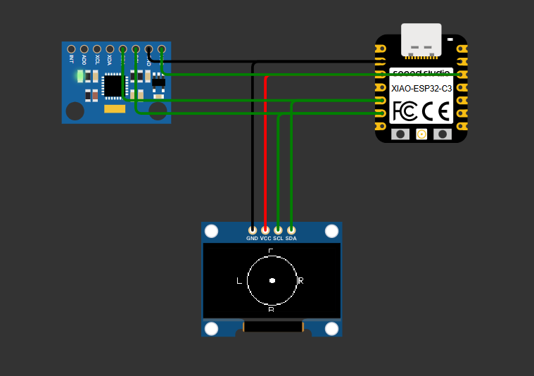
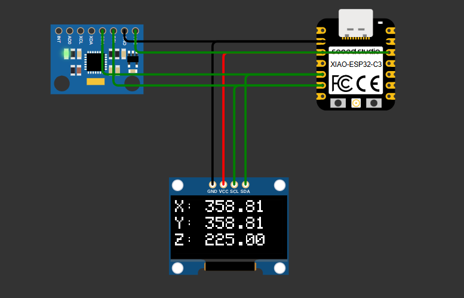

# MPU6050 Motion Display on OLED

This project visualizes real-time motion data from an MPU6050 accelerometer/gyroscope sensor on a 128x64 OLED display using an Arduino. There are **two versions** of the project, each offering different motion representations.

---

## 🔁 Version 1: Circular Motion Display

**Purpose:**  
Visually indicate the direction and intensity of motion (acceleration or braking, left or right movement) using a **moving dot inside a circle**.

**How it works:**
- A fixed circle is drawn in the center of the OLED.
- A dot inside the circle moves based on real-time accelerometer values:
  - **Up**: Accelerating
  - **Down**: Braking
  - **Left/Right**: Lateral motion
- The dot's movement is scaled to fit within the circle.

**Preview:**

---

## 📊 Version 2: Raw X, Y, Z Acceleration Values

**Purpose:**  
Displays the raw **X**, **Y**, and **Z** acceleration values as live data on the OLED for real-time monitoring or calibration.

**How it works:**
- The OLED shows the numerical values of `AcX`, `AcY`, and `AcZ`.
- Useful for debugging, calibration, or understanding how the sensor responds to movement or orientation.

**Preview:**

---

## 🧰 Hardware Required

- Arduino (Uno, Nano, etc.)
- MPU6050 module
- 0.96" I2C OLED display (SSD1306)
- Jumper wires

---

## ⚙️ Libraries Required

Install these from the Arduino Library Manager:

- `Wire.h` (built-in)
- `Adafruit_GFX`
- `Adafruit_SSD1306`

---

## 🚀 Getting Started

1. Connect the MPU6050 and OLED to your Arduino using I2C:
   - SDA → A4
   - SCL → A5
   - VCC → 3.3V or 5V (depending on module)
   - GND → GND

2. Upload `version1.ino` or `version2.ino` to your Arduino/esp32(C3,C6).
3. Observe the output on your OLED display.

---
